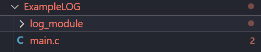

# LOG_MODULE

This project is a library (log_module.c/h files) which helps to generate a basic log to print different messages for different uses case like events, debug, warnings, errors, among others.

The project purpose is to give an example or a base for a general log where the user adds more type of events or log cases at his convenience, e. g., a LOG type for [ALERT], [EMERGENCY], [SUCCESS], [MODULE_A], [MODULE_B], and so on. It is important to clarify that the proyect has the uses cases or types of LOG labeled as: [INFO], [DEBUG], [WARNING], [ERROR] and [FATAL]
 
## Example main.c code

The next code is an example of how the library can work:

```
#include "log_module.h"

int main(int argc, char const *argv[])
{
    confLog(LOG_INFO_T, PATH_EN_T | NAME_FILE_EN_T | LINE_EN_T | DATE_EN_T);
    confLog(LOG_DEBUG_T, PATH_EN_T | NAME_FILE_EN_T | LINE_EN_T);
    confLog(LOG_WARNING_T, PATH_EN_T | NAME_FILE_EN_T);
    confLog(LOG_ERROR_T, PATH_EN_T);

    LOG_INFO("This is an INFO message.");
    LOG_DEBUG("This is a DEBUG message.");
    LOG_WARNING("This is a WARNING message.");
    LOG_ERROR("This is an ERROR message.");
    LOG_FATAL("This is a FATAL message.");
    return 0;
}
```
1. To configure any LOG 
   ```
   confLog(LOG_INFO_T, PATH_EN_T | NAME_FILE_EN_T | LINE_EN_T | DATE_EN_T);

   or

   confLog(LOG_INFO_T, ALL_ENABLED_T);
   ```
> [!NOTE] If you do not configure a LOG, the flags configuration for this log gets disabled.

2. Use the MACRO function for the configured LOG
   ```
    LOG_INFO("This is an INFO message.");
   ```

**Example output:**
```
[INFO] C:\Users\a_gc\Documents\Q\c\VS_CODE\LOG_test\ExampleLOG\main.c (Line 10) [2024-12-02 09:57:11]: This is an INFO message.
[DBG] C:\Users\a_gc\Documents\Q\c\VS_CODE\LOG_test\ExampleLOG\main.c (Line 11) : This is a DEBUG message.
[WRN] C:\Users\a_gc\Documents\Q\c\VS_CODE\LOG_test\ExampleLOG\main.c : This is a WARNING message.
[ERR] C:\Users\a_gc\Documents\Q\c\VS_CODE\LOG_test\ExampleLOG\: This is an ERROR message.
[FATAL] : This is a FATAL message.
```

## Compilation
First you have to download the library (or you can clone or add to your project as a submodule). 
The library location in your workspace should look as follows:



Then, the next step for compilation it can be realized using the next gcc command on the terminal:

```
gcc -g main.c log_module/log_module.c -I log_module -o main.exe
```

## Execution
To excecute the main.exe file you can use the next command:
```
.\main.exe
```

## Message
I hope you enjoy with this code, I know there are many ways to make a LOG with different features but I hope this example helps you. 

Remember that you can add different uses case and configure your own LOGS. These are useful to clasify the context of different messages. They help you to identify some code bugs or to see different events during execution of your proyect.

And remember, use

👍"Hello Dog! 🐶"

Instead of

✖️"Hello World!"


