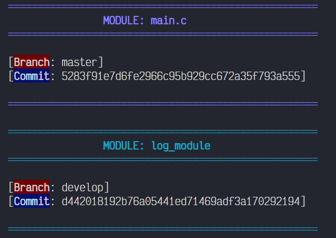

# LOG_MODULE

This project is a library (log_module.c/h files) which helps to generate a basic log to print different messages for different uses case like events, debug, warnings, errors, among others.

The project purpose is to give an example or a base for a general log creater, where the user can add his own at his convenience, e. g., a LOG type for [ALERT], [EMERGENCY], [SUCCESS], [MODULE_A], [MODULE_B], and so on.
 
### Usage example
To use the library efficiently way, it is recommended to create an extra layer .h file (e.g., my_logs.h) where the logs could be created. That layer allows the use of any created log in any module or library that includes the layer.

## Example of my_logs.h 

```
#ifndef _MY_LOGS_
#define _MY_LOGS_

#include "log_module.h"

CREATE_LOG_MACRO(USER, TXT_BLUE);
CREATE_LOG_MACRO(MODULE1, TXT_NAVY_BLUE);
CREATE_LOG_MACRO(MODULE2, TXT_PURPLE);
CREATE_LOG_MACRO(MODULE3, TXT_LILAC);
CREATE_LOG_MACRO(MODULE6, TXT_TURQUOISE);
CREATE_LOG_MACRO(EVENT1, TXT_L_LILAC);
CREATE_LOG_MACRO(EVENT2, TXT_GREEN_DRK);
CREATE_LOG_MACRO(EVENT3, TXT_CYAN);
CREATE_LOG_MACRO(EVENT4, TXT_BLACK);
CREATE_LOG_MACRO(EVENT5, TXT_GRAY);
CREATE_LOG_MACRO(EVENT6, TXT_BROWN);
CREATE_LOG_MACRO(EVENT7, TXT_VINE);
CREATE_LOG_MACRO(EVENT8, TXT_WHITE);

CREATE_LOG_MACRO(INFO, TXT_L_TURQUOISE);
CREATE_LOG_MACRO(DEBUG, TXT_GREEN);
CREATE_LOG_MACRO(WARNING, TXT_YELLOW);
CREATE_LOG_MACRO(ERROR, TXT_ORAGE);
CREATE_LOG_MACRO(FATAL, TXT_RED);

#endif //_MY_LOGS_
```

## Example of main.c code

The next code is an example of how the library can work:

```
#include "myLogs.h"

int main(int argc, char const *argv[])
{ 
    GIT_VERSION();
    GIT_VERSION_LOG();
    
    confLog(LOG_INFO_T, (PATH_EN_T | NAME_FILE_EN_T | LINE_EN_T | DATE_EN_T) | LOG_ENABLE_T);
    confLog(LOG_DEBUG_T, (PATH_EN_T | NAME_FILE_EN_T | LINE_EN_T) | LOG_ENABLE_T);
    confLog(LOG_WARNING_T, PATH_EN_T | NAME_FILE_EN_T | LOG_ENABLE_T);
    confLog(LOG_ERROR_T, PATH_EN_T | LOG_ENABLE_T);

    LOG_MODULE1(FL,"This is a MODULE1 message.");
    LOG_USER(FL,"dog.");
    LOG_MODULE6(FL,"This is a MODULE1 message.");
    LOG_INFO(FL,"This is an INFO message.");
    LOG_MODULE2(FL,"This is a MODULE2 message.");
    LOG_MODULE3(FL,"This is a MODULE3 message.");
    LOG_EVENT1(FL,"This is a EVENT1 message.");
    LOG_EVENT2(FL,"This is a EVENT2 message.");
    LOG_EVENT3(FL,"This is a EVENT3 message.");
    LOG_DEBUG(FL,"This is a DEBUG message.");
    LOG_EVENT4(FL,"This is a EVENT4 message.");
    LOG_EVENT5(FL,"This is a EVENT5 message.");
    LOG_EVENT6(FL,"This is a EVENT6 message.");
    LOG_EVENT7(FL,"This is a EVENT7 message.");
    LOG_EVENT8(FL,"This is a EVENT8 message.\n");

    LOG_INFO(FL, "This is a INFO message.");
    LOG_DEBUG(FL,"This is a DEBUG message.");
    LOG_WARNING(FL,"This is a WARNING message.");
    LOG_ERROR(FL,"This is an ERROR message.");
    LOG_FATAL(FL,"This is a FATAL message.");

    printf("Press Enter key to exit...");
    getchar();

    return 0;
}
```
1. To configure any LOG 
   ```
   confLog(LOG_INFO_T, PATH_EN_T | NAME_FILE_EN_T | LINE_EN_T | DATE_EN_T | LOG_ENABLE_T);

   or

   confLog(LOG_INFO_T, ALL_ENABLED_T);
   ```
> [!NOTE] If you do not configure a LOG, the flags configuration for this log gets disabled except LOG_ENABLE_T.

2. Use the MACRO function for the configured LOG. In addition, you should pass the MACRO LF to the first argument.
   ```
   LOG_INFO(LF, "This is an INFO message.");

   or 

   uint8_t value = 7; 
   LOG_INFO(LF, "This is an INFO message. value: %d", value);
   ```

**Example output:**
```
====================================================
            MODULE: main.c             
====================================================

[Branch: master]
[Commit: 5283f91e7d6fe2966c95b929cc672a35f793a555]

====================================================

====================================================
               MODULE: log_module                 
====================================================

[Branch: develop]
[Commit: d442018192b76a05441ed71469adf3a170292194]

====================================================

[MODULE1] : This is a MODULE1 message.
[USER] : dog.
[MODULE6] : This is a MODULE1 message.
[INFO] /mnt/c/Users/a_gc/Documents/Q/c/VS_CODE/LOG_test/ExampleLOG/main.c (Line 16) [2024-12-17 15:30:54]: This is an INFO message.  
[MODULE2] : This is a MODULE2 message.
[MODULE3] : This is a MODULE3 message.
[EVENT1] : This is a EVENT1 message.
[EVENT2] : This is a EVENT2 message.
[EVENT3] : This is a EVENT3 message.
[DEBUG] /mnt/c/Users/a_gc/Documents/Q/c/VS_CODE/LOG_test/ExampleLOG/main.c (Line 22) : This is a DEBUG message.
[EVENT4] : This is a EVENT4 message.
[EVENT5] : This is a EVENT5 message.
[EVENT6] : This is a EVENT6 message.
[EVENT7] : This is a EVENT7 message.
[EVENT8] : This is a EVENT8 message.

[INFO] /mnt/c/Users/a_gc/Documents/Q/c/VS_CODE/LOG_test/ExampleLOG/main.c (Line 30) [2024-12-17 15:30:54]: This is a INFO message.   
[DEBUG] /mnt/c/Users/a_gc/Documents/Q/c/VS_CODE/LOG_test/ExampleLOG/main.c (Line 31) : This is a DEBUG message.
[WARNING] /mnt/c/Users/a_gc/Documents/Q/c/VS_CODE/LOG_test/ExampleLOG/main.c : This is a WARNING message.
[ERROR] /mnt/c/Users/a_gc/Documents/Q/c/VS_CODE/LOG_test/ExampleLOG/: This is an ERROR message.
[FATAL] : This is a FATAL message.
Press Enter key to exit...
```



## Compilation
First you have to download the library (or you can clone or add to your project as a submodule). 
The library location in your workspace should look as follows:


Then, the next step for compilation it can be realized using the next gcc command on the terminal:

```
gcc -g main.c ./log_module/log_module.c -I log_module -o main.exe
```

## Execution
To excecute the main.exe file you can use the next command:
```
.\main.exe
```

## Message
I hope you enjoy this code, I know there are many ways to make a LOG with different features but I hope this example helps you. 

Remember that you can create different uses case and configure your own LOGS. These are useful to clasify the context of different messages. They help you to identify some code bugs or to see different events during the execution of your project.

And remember, use

👍"Hello Dog! 🐶"

Instead of

✖️"Hello World!"


